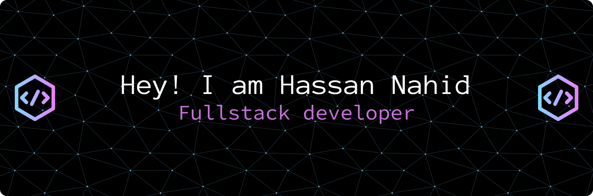

## 💫 About Me:
 

Hello! I'm Hassan Nahid, a passionate full-stack developer with a strong background in building modern web applications. I specialize in TypeScript, JavaScript, React, Next.js, Node.js, and a variety of backend and cloud technologies. My focus is on creating scalable, performant, and user-friendly solutions that make a difference.

I enjoy collaborating with teams, learning new technologies, and solving challenging problems. Whether it's designing robust APIs, crafting beautiful UIs, or deploying apps to the cloud, I strive for excellence in every project.

**Let's connect and build something amazing together!**

## 🌐 Socials:
     

## 💻 Tech Stack:

### 🖥️ Frontend

	
	
	
	
	
	
	
	
	
	

### 🛠️ Backend

	
	
	
	
	
	
	
	
	

### ☁️ Other & Tools

	
	
	
	
	
	
	
	
	

### 🧩 Familiar With

	
	

## 📊 GitHub Stats:
 
 

### 🏆 GitHub Trophies

### 🔝 Top Contributed Repo

---

